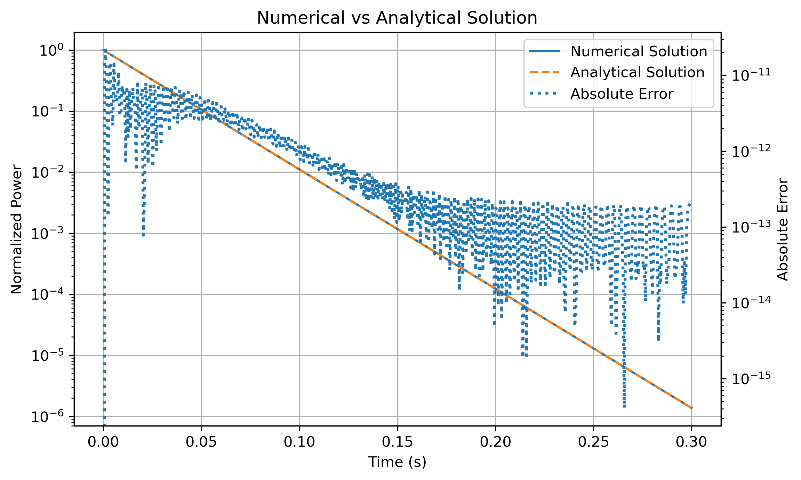

# Reactor Point Kinetics Simulation

## Objective

This project implements a simplified reactor point kinetics model to investigate the effect of reactivity on reactor power evolution.

The model solves the governing differential equation numerically and validates the results against the analytical solution.

---

## Physical Background

Reactor kinetics describes the time-dependent behavior of neutron population and reactor power.

In this simplified model, reactor power is represented using a single point variable and the dynamics are governed by the balance between reactivity and delayed neutron effects.

The simulation explores how different reactivity insertions influence reactor behavior under subcritical and supercritical conditions.

---

## Governing Equation

The reactor power is described by:

dP/dt = ((ρ - β)/Λ) P

where:

- P = normalized reactor power
- ρ = reactivity
- β = effective delayed neutron fraction
- Λ = neutron generation time

---

## Parameters

| Parameter | Value |
|------------|------------|
| β | 0.0065 |
| Λ | 1 × 10⁻⁴ s |
| Initial Power | 1.0 |

The model evaluates several reactivity values:

| Case | Reactivity |
|--------|--------|
| Subcritical | -0.002 |
| Critical-like | 0.000 |
| Near Critical | 0.002 |
| Higher Reactivity | 0.004 |
| Supercritical | 0.008 |

---

## Methodology

The governing ordinary differential equation was solved numerically using SciPy's `solve_ivp()` solver.

To verify the implementation, the numerical solution was compared with the analytical solution:

P(t) = P₀ exp[((ρ - β)/Λ)t]

The comparison allows direct validation of the numerical model.

---

## Tools

- Python
- NumPy
- SciPy
- Matplotlib

---

## Results

### Power Evolution for Different Reactivities

The simulations show the expected reactor response:

- Negative reactivity leads to power reduction.
- Reactivity values approaching β produce slower decay.
- Positive reactivity above β results in power growth.
- The reactor response is highly sensitive to small reactivity changes.

---

## Model Validation

### Numerical vs Analytical Solution

The numerical solution was compared against the analytical solution of the governing equation.

Excellent agreement was observed throughout the simulation interval, confirming the correctness of the numerical implementation.

### Error Analysis

The absolute error between numerical and analytical solutions remained extremely small throughout the simulation.

The maximum observed error was on the order of machine precision, demonstrating the accuracy of the solver for this problem.

---

## Engineering Interpretation

Reactivity is one of the most important parameters in reactor operation and safety analysis.

This simplified model illustrates how even small reactivity variations can significantly alter reactor power evolution.

Although the model does not include delayed neutron precursor groups or feedback mechanisms, it captures the fundamental relationship between reactivity and power behavior and serves as an introduction to reactor dynamics simulations.

---

## Skills Demonstrated

- Reactor physics fundamentals
- Point kinetics modeling
- Numerical solution of ODEs
- Model verification and validation
- Scientific computing with Python
- Data visualization
- Engineering analysis
- Git and GitHub workflow

---

## Future Improvements

Potential extensions include:

- Six-group delayed neutron model
- Reactivity insertion transients
- Temperature feedback effects
- Xenon poisoning simulations
- Coupling with thermal-hydraulic models
- Point kinetics benchmark comparisons

---

## Relevance to Nuclear Engineering

Point kinetics models are widely used in:

- Reactor startup studies
- Reactivity management
- Nuclear safety analysis
- Transient simulations
- Reactor operator training
- Reactor dynamics education

Understanding reactor kinetics is fundamental for nuclear engineers involved in reactor analysis, safety assessment, and reactor operation.
