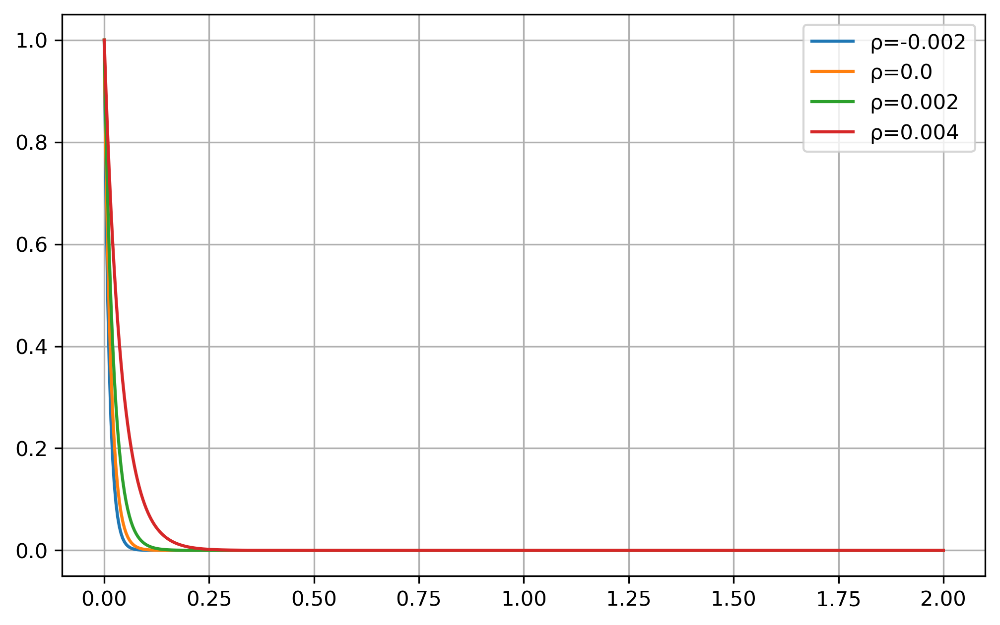
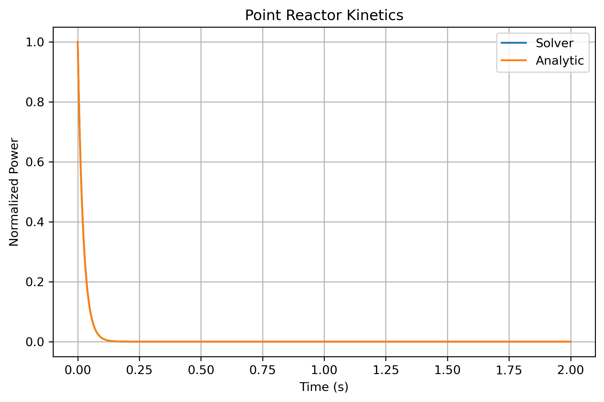

# Reactor Point Kinetics Simulation

## Objective

This project implements a simplified point reactor kinetics model to study the effect of reactivity changes on reactor power.

The objective is to understand the dynamic response of a nuclear reactor under subcritical, critical, and supercritical conditions using numerical methods in Python.

---

## Physical Background

Point kinetics is one of the fundamental models used in reactor physics to describe the time-dependent behavior of neutron population and reactor power.

In this simplified model, delayed neutrons are represented through the effective delayed neutron fraction, and the reactor power evolution is governed by a first-order differential equation.

The model allows investigation of how different reactivity insertions affect reactor behavior.

---

## Governing Equation

The reactor power is described by:

dP/dt = ((ρ - β)/Λ) P

where:

- P = reactor power
- ρ = reactivity
- β = effective delayed neutron fraction
- Λ = neutron generation time

---

## Parameters

| Parameter | Value |
|------------|------------|
| β | 0.0065 |
| Λ | 1 × 10⁻⁴ s |
| Initial Power | 1 (normalized) |

The simulation evaluates several reactivity conditions:

| Case | Reactivity (ρ) |
|--------|--------|
| Subcritical | -0.002 |
| Critical-like | 0.000 |
| Slightly Supercritical | 0.002 |
| Higher Reactivity | 0.004 |

---

## Methodology

The governing differential equation was solved numerically using SciPy's `solve_ivp()` function.

The reactor response was simulated for different reactivity values and compared against the analytical solution of the governing equation.

---

## Tools

- Python
- NumPy
- SciPy
- Matplotlib

---

## Results

### Power Evolution for Different Reactivities



The simulations show the expected reactor behavior:

- Negative reactivity causes power reduction.
- Zero reactivity maintains constant power.
- Positive reactivity produces power growth.
- Larger reactivity insertions result in faster power increases.

---

## Model Validation



The analytical solution of the governing equation is:

P(t) = P₀ exp[((ρ - β)/Λ)t]

The numerical solution obtained with SciPy was compared with the analytical expression and showed excellent agreement.

This comparison validates the numerical implementation.


---

## Engineering Interpretation

Reactivity is one of the most important parameters in reactor operation and safety.

Small changes in reactivity can significantly affect reactor power and therefore fuel temperature, thermal margins, and overall reactor behavior.

Although simplified, this model captures the essential relationship between reactivity and power evolution and provides insight into the dynamic response of nuclear systems.

---

## Skills Demonstrated

- Reactor physics fundamentals
- Point kinetics modeling
- Ordinary differential equations (ODEs)
- Numerical integration with SciPy
- Scientific computing with Python
- Data visualization
- Engineering problem solving
- Git and GitHub workflow

---

## Future Improvements

Potential extensions include:

- Delayed neutron precursor groups
- Full point kinetics equations
- Reactivity insertion accidents
- Temperature feedback effects
- Xenon poisoning effects
- Coupling with thermal-hydraulic models
- Comparison with reactor transient benchmarks

---

## Repository Structure

```text
reactor-point-kinetics/
│
├── reactor_point_kinetics.ipynb
├── README.md
└── figures/
    └── reactor_kinetics.png
```

---

## Relevance to Nuclear Engineering

Point kinetics models are widely used in:

- Reactor startup analysis
- Reactivity management
- Safety studies
- Transient analysis
- Nuclear operator training
- Reactor dynamics education

Understanding reactor kinetics is fundamental for nuclear engineers working in reactor operation, safety assessment, and reactor design.